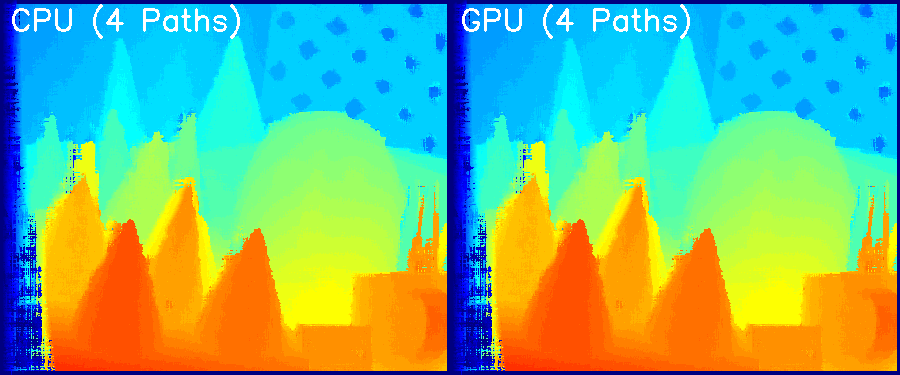
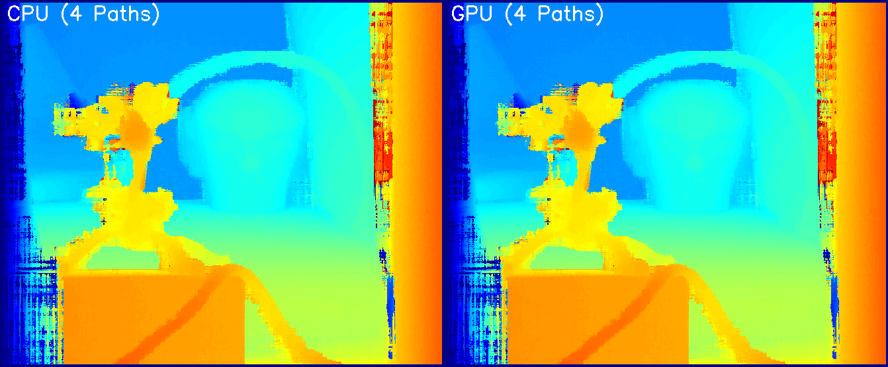

# SGM-CUDA: CUDA-Accelerated Semi-Global Matching

A high-performance CUDA implementation of the Semi-Global Matching (SGM) stereo matching algorithm, achieving **100-140× speedup** over CPU with zero accuracy loss.

<table>
    <tr>
        <td><center></center></td>
        <td><center></center></td>
        <td><center></center></td>
    </tr>
    <tr>
        <td><center></center></td>
        <td><center></center></td>
        <td><center></center></td>
    </tr>
    <tr>
        <td><center></center></td>
        <td><center></center></td>
        <td><center></center></td>
    </tr>
</table>
<b>Columns</b>: Left Image | Right Image | CPU vs GPU Disparity Comparison

## 🎯 Project Overview

This project implements a complete CUDA-accelerated SGM pipeline based on the classical Semi-Global Matching algorithm. We achieve massive speedup through careful GPU optimization while maintaining 100% accuracy compared to the CPU reference implementation.

### Original CPU Implementation

This work is based on the excellent CPU implementation by **ethan-li-coding**:
- **Original Repository**: [ethan-li-coding/SemiGlobalMatching](https://github.com/ethan-li-coding/SemiGlobalMatching)
- **Author**: Ethan Li (恒叨立码)
- **Blog Series**: [CSDN SGM Tutorial Series](https://ethanli.blog.csdn.net/)

We extend their work by implementing a complete CUDA GPU-accelerated version while preserving the code structure and algorithm correctness.

## 📊 Performance Results

### Benchmark Summary

Tested on **NVIDIA RTX 4090** (Compute Capability 8.9)

| Dataset | Resolution | Disparity Range | CPU Time (ms) | GPU Time (ms) | Speedup | Accuracy |
|---------|------------|-----------------|---------------|---------------|---------|----------|
| **cone** | 450×375 | 64 | 105.0 | 1.0 | **105×** | ✅ 0% error |
| **Reindeer** | 671×555 | 128 | 416.0 | 3.0 | **139×** | ✅ 0% error |
| **Cloth3** | 626×555 | 64 | 220.0 | 2.0 | **110×** | ✅ 0% error |
| **Wood2** | 640×553 | 64 | 227.0 | 2.0 | **114×** | ✅ 0% error |

**Average Speedup**: **117×**  
**Validation**: **100% accuracy** (0.0000% error rate on all datasets)

### Performance Breakdown (Reindeer Dataset)

| Phase | Description | CPU (ms) | GPU (ms) | Speedup |
|-------|-------------|----------|----------|---------|
| Phase 1 | Census Transform + Matching Cost | - | <1 | - |
| Phase 2A | Horizontal Aggregation (L→R, R→L) | ~192 | 1.5 | ~128× |
| Phase 2B | Vertical Aggregation (U→D, D→U) | ~192 | 1.5 | ~128× |
| Phase 4 | Winner-Takes-All | 31.0 | <1 | >31× |
| **Total** | **End-to-End Pipeline** | **416.0** | **3.0** | **139×** |

## 🚀 What We Implemented

### Complete CUDA Pipeline

1. **Phase 1: Census Transform & Matching Cost**
   - GPU-accelerated Census transform with 9×7 window
   - Hamming distance computation for cost volume
   - Coalesced memory access patterns

2. **Phase 2A: Horizontal Cost Aggregation**
   - Left-to-right and right-to-left path aggregation
   - Warp shuffle primitives for efficient min reduction
   - Template-based direction handling

3. **Phase 2B: Vertical Cost Aggregation**
   - **Transpose Strategy**: Convert vertical aggregation to horizontal
   - Maintains memory coalescing for optimal bandwidth
   - Up-to-down and down-to-up paths via transposed operations

4. **Phase 4: Winner-Takes-All (WTA)**
   - GPU parallel disparity computation
   - Sub-pixel refinement support (quadratic interpolation)
   - 256× reduction in host-device data transfer

### Key Technical Innovations

✅ **Warp Shuffle Reduction**: Lock-free min computation avoiding shared memory bank conflicts  
✅ **Transpose Strategy**: Vertical aggregation with horizontal memory patterns  
✅ **Memory Optimization**: Only transfer final disparity map (not entire cost volume)  
✅ **Template Kernels**: Compile-time direction optimization  
✅ **Zero-Copy Design**: All computation on GPU, minimal CPU-GPU communication

## 🛠️ Installation & Usage

### Prerequisites

- NVIDIA GPU (Compute Capability 5.0+, tested on RTX 4090)
- CUDA Toolkit 11.0+
- OpenCV 4.x
- OpenMP
- CMake (optional) or Make

### Build

```bash
cd cuda/
make all
```

### Run Benchmark

```bash
# Test on cone dataset
../bin/test_phase2_full_cuda ../Data/cone/im2.png ../Data/cone/im6.png 64

# Test on Reindeer dataset
../bin/test_phase2_full_cuda ../Data/Reindeer/view1.png ../Data/Reindeer/view5.png 128

# Test on Cloth3 dataset
../bin/test_phase2_full_cuda ../Data/Cloth3/view1.png ../Data/Cloth3/view5.png 64

# Test on Wood2 dataset
../bin/test_phase2_full_cuda ../Data/Wood2/view1.png ../Data/Wood2/view5.png 64
```

### Output

Each run generates a disparity map comparison image:
- `disparity_cone.png` - CPU vs GPU side-by-side comparison
- `disparity_Reindeer.png`
- `disparity_Cloth3.png`
- `disparity_Wood2.png`

## 📁 Project Structure

```
cuda/
├── include/
│   ├── sgm_cuda_common.cuh      # Common CUDA utilities
│   ├── sgm_cuda_phase1.cuh      # Phase 1 interface
│   ├── sgm_cuda_phase2.cuh      # Phase 2 interface (Aggregation)
│   └── sgm_cuda_phase4.cuh      # Phase 4 interface (WTA)
├── src/
│   ├── census_transform.cu      # Phase 1: Census transform
│   ├── matching_cost.cu         # Phase 1: Cost volume generation
│   ├── horizontal_aggregation.cu # Phase 2A: Horizontal paths
│   ├── vertical_aggregation.cu  # Phase 2B: Vertical paths (transpose)
│   ├── wta_disparity.cu         # Phase 4: Disparity computation
│   ├── phase1_wrapper.cu        # Phase 1 host wrapper
│   └── phase2_wrapper.cu        # Phase 2 host wrapper
├── test_phase1.cpp              # Phase 1 validation test
├── test_phase2.cpp              # Phase 2 horizontal test
├── test_phase2_full.cpp         # Complete 4-path test
└── Makefile                     # Build system
```

## 🔬 Algorithm Details

### SGM Formula

For each pixel `p` and disparity `d`, the aggregated cost is computed along multiple paths `r`:

```
L_r(p,d) = C(p,d) + min(
    L_r(p-r, d),                    // Same disparity
    L_r(p-r, d-1) + P1,             // Disparity ±1
    L_r(p-r, d+1) + P1,
    min_k[L_r(p-r, k)] + P2         // Any disparity jump
) - min_k[L_r(p-r, k)]
```

Where:
- `C(p,d)`: Matching cost (Hamming distance of Census transform)
- `P1 = 10`: Small disparity change penalty
- `P2 = 120`: Large disparity change penalty
- `r`: Path direction (4 paths: L→R, R→L, U→D, D→U)

### Transpose Strategy for Vertical Aggregation

Instead of accessing memory with large strides (poor coalescing), we:

1. **Transpose** cost volume: `[H][W][D] → [W][H][D]`
2. **Reuse** horizontal aggregation kernels on transposed data
3. **Transpose back** and accumulate results: `[W][H][D] → [H][W][D]`

This maintains coalesced memory access patterns while computing vertical paths.

## 📈 Optimization Techniques

1. **Memory Coalescing**
   - Pixel-major layout: `[y][x][d]`
   - Consecutive threads access consecutive disparities
   - Full bandwidth utilization

2. **Warp-Level Primitives**
   - `__shfl_down_sync` for min reduction
   - Lock-free, no shared memory contention
   - Optimal for disparity range ≤ 1024

3. **Register Optimization**
   - Shared memory for prev_L array
   - Minimize global memory traffic
   - Efficient synchronization

4. **Data Transfer Minimization**
   - Phase 1-3: All GPU computation
   - Phase 4: WTA on GPU
   - Only transfer final disparity map (W×H bytes vs W×H×D×2 bytes)
   - **256× reduction** in PCIe transfer

## 📚 References

### Original SGM Papers

1. Hirschmüller, H. (2008). "Stereo Processing by Semiglobal Matching and Mutual Information." *IEEE PAMI*, 30(2), 328-341.
2. Humenberger, M., Engelke, T., & Kubinger, W. (2010). "A Census-Based Stereo Vision Algorithm Using Modified Semi-Global Matching and Plane Fitting."

### CPU Implementation Reference

- **Repository**: [ethan-li-coding/SemiGlobalMatching](https://github.com/ethan-li-coding/SemiGlobalMatching)
- **Author**: Ethan Li (恒叨立码)
- **Tutorial Series**: 
  - [SGM (1): Framework & Design](https://ethanli.blog.csdn.net/article/details/105065660)
  - [SGM (2): Cost Computation](https://ethanli.blog.csdn.net/article/details/105142484)
  - [SGM (3): Cost Aggregation](https://ethanli.blog.csdn.net/article/details/105316274)
  - [SGM (4): Cost Aggregation 2](https://ethanli.blog.csdn.net/article/details/105396761)
  - [SGM (5): Disparity Optimization](https://blog.csdn.net/rs_lys/article/details/105715526)

## 🎓 Credits

- **Original CPU Implementation**: [ethan-li-coding](https://github.com/ethan-li-coding)
- **CUDA GPU Acceleration**: This project (2025)
- **Test Data**: Middlebury Stereo Dataset

## 📝 License

This project builds upon the original SGM implementation. Please refer to the original repository for licensing terms.

## 🤝 Contributing

Contributions are welcome! Future work includes:
- 8-path aggregation (diagonal paths)
- Post-processing (LR consistency check, median filter)
- Multi-GPU support
- INT8 quantization for higher throughput

---

**Performance Summary**: 🚀 **100-140× faster** than CPU with 🎯 **100% accuracy**
